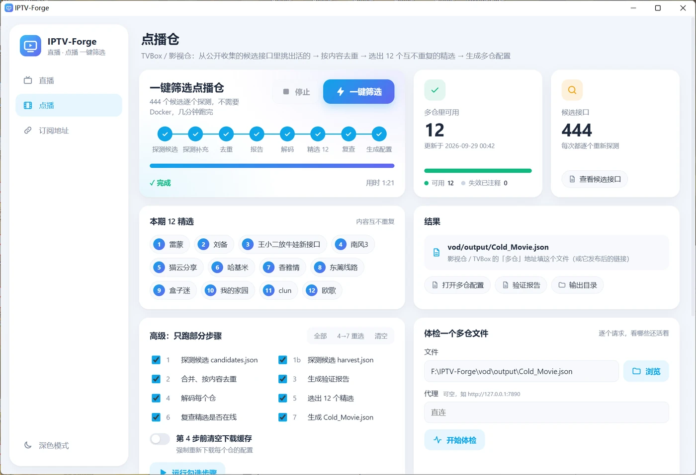
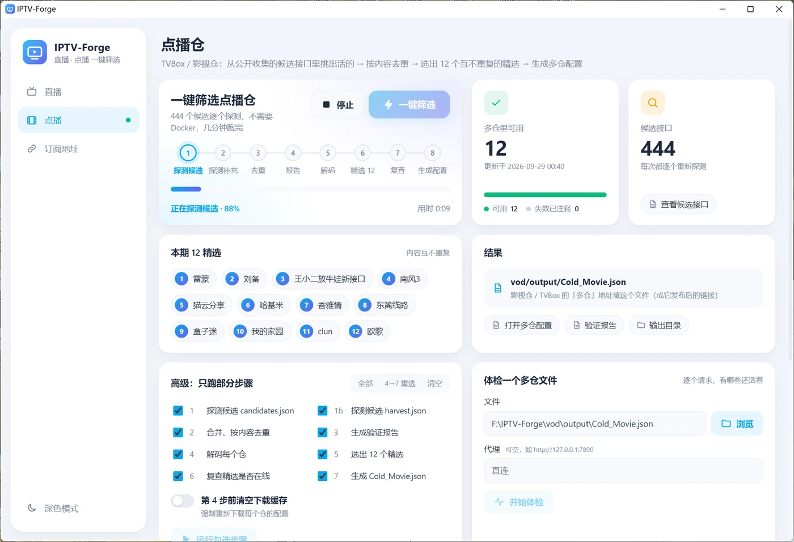
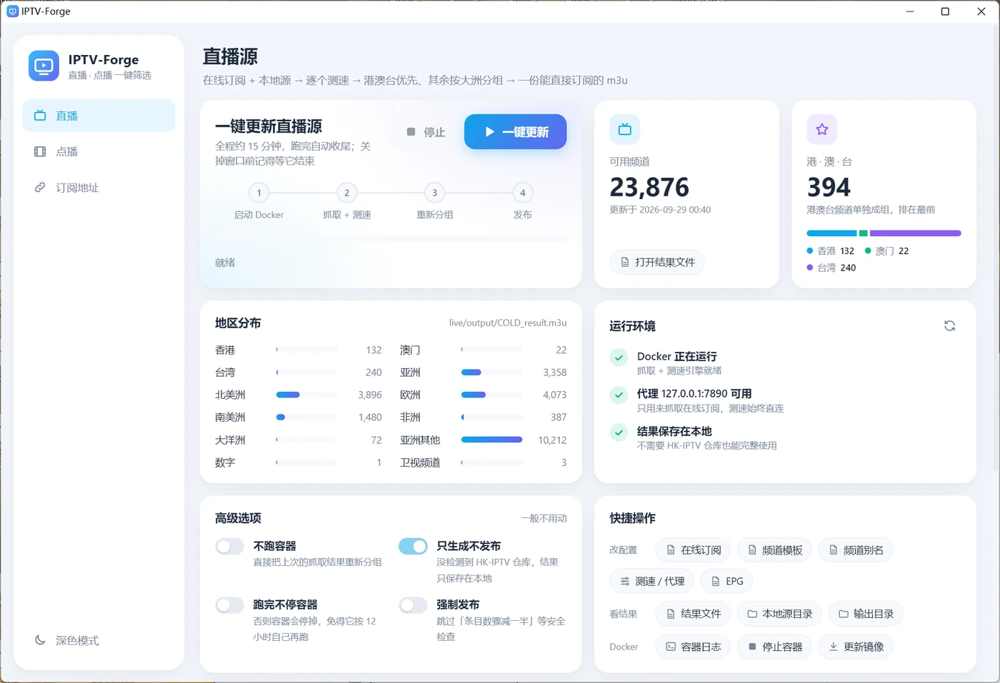
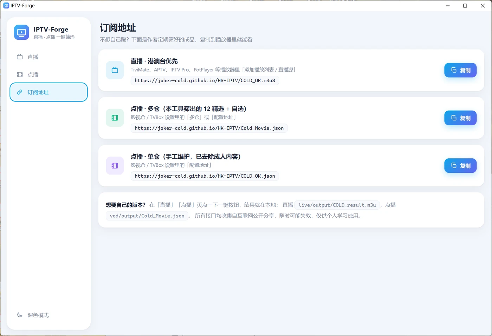
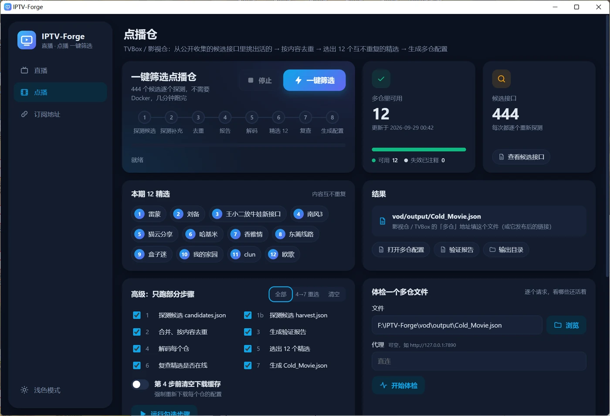

<div align="center">


# IPTV-Forge

**直播源 + 点播仓，一键筛选，点点鼠标就好**

下载 → 双击 → 点一下，拿到一份测过速、去过重、能直接订阅的直播源 / 影视仓配置


### [⬇️ 下载 IPTV-Forge-windows.zip](https://github.com/Joker-Cold/IPTV-Forge/releases/latest/download/IPTV-Forge-windows.zip)



</div>

## 🛋️ 最懒：直接复制订阅地址

作者定期用这个工具筛好的成品，复制到播放器里就能看：

| 内容 | 订阅地址 | 填到哪 |
|---|---|---|
| 📺 直播 · 港澳台优先 | `https://joker-cold.github.io/HK-IPTV/COLD_OK.m3u8` | TiviMate、APTV、PotPlayer 等的「添加播放列表 / 直播源」 |
| 🎬 点播 · 多仓（12 精选 + 自选） | `https://joker-cold.github.io/HK-IPTV/Cold_Movie.json` | 影视仓 / TVBox 的「多仓」 |
| 🎬 点播 · 单仓（已去除成人内容） | `https://joker-cold.github.io/HK-IPTV/COLD_OK.json` | 影视仓 / TVBox 的「配置地址」 |

软件里的「订阅地址」页也能一键复制。

## ⚡ 想要自己的版本：三步

1. **下载**：[Releases](https://github.com/Joker-Cold/IPTV-Forge/releases/latest) 里的 **`IPTV-Forge-windows.zip`**（[直接下载](https://github.com/Joker-Cold/IPTV-Forge/releases/latest/download/IPTV-Forge-windows.zip)），解压到任意位置
2. **双击** 解压出来的 `IPTV-Forge.exe`
3. **点一下**：点播页「一键筛选」，直播页「一键更新」

不用装 Python，不用敲命令，每一步的进度和日志都实时显示在窗口里。

| | 🎬 点播 · 一键筛选 | 📺 直播 · 一键更新 |
|---|---|---|
| **做了什么** | 400 多个公开候选接口逐个探测 → 按内容去重（换了域名的同一份配置也认得出）→ 解开 4 种加密格式 → 选出 12 个内容互不重复的精选 | 在线订阅 + 本地源逐个测速 → 港澳台单独成组排最前，其余按大洲分组 |
| **需要** | 能上网就行 | [Docker Desktop](https://www.docker.com/products/docker-desktop/)（测速引擎跑在里面）；GitHub 上的订阅源在国内最好开着代理 |
| **用时** | 约 1.5 分钟 | 约 15 分钟 |
| **结果** | `vod/output/Cold_Movie.json` | `live/output/COLD_result.m3u` |

> 结果怎么放到电视 / 手机上：电脑上的播放器可以直接打开这个文件；电视和手机要填网址，
> 把文件传到自己的 GitHub / Gitee 仓库或者任何能直链的网盘就行。

## 🖼️ 界面一览

| 点播：步骤条 + 实时进度 | 直播：地区分布 + 环境自检 |
|---|---|
|  |  |
| **订阅地址：一键复制** | **深色模式** |
|  |  |

- **一键到底**：步骤条、进度条、彩色日志实时刷新，随时可以停
- **环境自检**：Docker 装没装、开没开，代理通不通，一眼看清，缺什么给出下载链接
- **一个按钮打开**：订阅源、频道模板、别名、测速参数、结果文件、验证报告
- **多仓体检**：随便拿一个多仓文件，看里面哪些仓还活着
- **浅色 / 深色** 两套主题，关掉再开会记住

## ❓ 常见问题

**需要装 Python 吗？**
不需要，`IPTV-Forge.exe` 自带运行环境。

**只下载 exe 能用吗？**
不能单独用：它要读写旁边的 `live/`、`vod/`、`iptv_api/` 目录，所以请下载完整包 `IPTV-Forge-windows.zip`。
已经 `git clone` 了仓库的话，只从 Releases 下 `IPTV-Forge.exe` 放进仓库根目录就行。

**杀毒软件报毒？**
Python 打包成的 exe 常见的误报。介意的话用源码跑：`pip install pywebview requests cryptography`，
然后 `python gui/forge_gui.py`，界面完全一样。

**直播结果很少 / 抓不到？**
看直播页的「运行环境」：Docker 要装好；代理连不上时在线订阅会抓取失败，结果只剩本地源。
代理地址在「快捷操作 → 测速 / 代理」里的 `http_proxy` 一行。

**点播里的仓过几天失效了？**
公开接口随时可能跑路，重新点一次「一键筛选」就行，失效的会被自动注释掉。

**Windows 7 / macOS？**
界面依赖 Windows 10 / 11 自带的 WebView2。其他系统可以按下面「进阶」直接用命令行跑脚本。

---

## 🔧 进阶

<details>
<summary><b>目录结构 & 工作原理</b></summary>

```
├── IPTV-Forge.exe         图形界面，双击运行（在 Releases 里，不入库）
├── update_live.bat        命令行版一键更新直播
├── gui/                   界面：forge_gui.py（后台）+ ui/（页面）+ 打包脚本
├── iptv_api/              直播抓取+测速引擎（iptv-api Docker 镜像）的配置
│   ├── docker-compose.yml
│   └── config/            订阅、频道模板、别名、测速参数、EPG
├── live/                  直播
│   ├── sources/           手工收集的本地直播源，挂载为容器的 config/local
│   ├── post_classify.py   按 香港/澳门/台湾/各大洲 重新分组
│   └── update_live.py     一键流程本体
├── vod/                   点播
│   ├── sources/           候选接口
│   ├── data/              中间结果（探测报告等）
│   ├── output/            多仓source.json、selected_12.json、verify_report.md
│   ├── paths.py           所有文件路径只在这里定义
│   └── *.py               流水线脚本，见下文
└── assets/                README 用的截图
```

界面上的每个按钮背后都是下面这些脚本，脚本本身也能单独在命令行跑。
`IPTV-Forge.exe` 内置了 Python 和脚本用到的库，用 `IPTV-Forge.exe --run <脚本> [参数]` 的方式运行它们，
所以脚本改了直接生效，不用重新打包。

命令行跑需要 Python 3.11 + `pip install requests cryptography`；直播还要 Docker Desktop 和宿主机 HTTP 代理
（端口在 [user_config.ini](iptv_api/config/user_config.ini) 的 `http_proxy`）。

</details>

<details>
<summary><b>直播：流程、命令行参数、想改什么去哪改</b></summary>

```
iptv_api/config/subscribe.txt   在线订阅 ┐
live/sources/*                  本地源   ├─ iptv-api 容器 抓取+测速 ─→ iptv_api/output/cold_result.m3u
iptv_api/config/user_demo.txt   频道模板 ┘
    ─→ live/post_classify.py ─→ live/output/COLD_result.m3u ─→ ../HK-IPTV/COLD_OK.m3u8（作者自用，见下）
```

命令行：双击 [update_live.bat](update_live.bat)（约 15 分钟）。流程在 [live/update_live.py](live/update_live.py)：

1. 确认 Docker 在跑，没开就启动 Docker Desktop
2. 检查代理能不能连上，连不上只警告（订阅会抓取失败）
3. 重建 `iptv-api` 容器 —— `update_startup=True`，一启动就跑一次完整更新；等日志出现「更新完成」
4. 停掉容器（不然它会按 12 小时间隔自己再跑，那些结果并不会被发布）
5. [post_classify.py](live/post_classify.py) 分组，复制到 `../HK-IPTV/COLD_OK.m3u8`。以下情况拒绝发布：
   结果是跑到一半的「正在更新中」版本，或条目数比当前发布版少一半以上

参数加在 bat 后面，例如 `update_live.bat --no-docker`（界面里的「高级选项」就是这几个）：

| 参数 | 作用 |
|---|---|
| `--no-docker` | 不跑容器，直接处理上一次的结果 |
| `--no-publish` | 只生成 `live/output/COLD_result.m3u`，不复制到 HK-IPTV（没有 HK-IPTV 时命令行要加它，界面会自动加） |
| `--keep-running` | 跑完不停容器 |
| `--force` | 跳过上面两条发布检查 |

| 想要 | 改这里 |
|---|---|
| 加/删在线订阅源 | [iptv_api/config/subscribe.txt](iptv_api/config/subscribe.txt) |
| 加本地源文件（m3u / txt） | 放进 [live/sources/](live/sources/) |
| 频道列表和分类 | [iptv_api/config/user_demo.txt](iptv_api/config/user_demo.txt) |
| 频道别名（繁简/英文/带后缀的各种写法） | [iptv_api/config/alias.txt](iptv_api/config/alias.txt) |
| 测速门槛、并发、代理、更新间隔 | [iptv_api/config/user_config.ini](iptv_api/config/user_config.ini) |
| EPG 节目单 | [iptv_api/config/epg.txt](iptv_api/config/epg.txt) |
| 最终结果的地区分组规则 | [live/post_classify.py](live/post_classify.py) |

注意：

- 容器跑的是 `guovern/iptv-api:latest` 镜像，本仓库只提供它的 `config/` 和 compose 文件。
  升级镜像：界面里「更新镜像」，或 `docker compose -f iptv_api/docker-compose.yml pull`。
- 测速必须直连：[docker-compose.yml](iptv_api/docker-compose.yml) 里故意不设 `HTTP_PROXY`（原因见其注释），
  代理只在 `user_config.ini` 里给订阅抓取用。
- `user_config.ini` 的 `open_auto_disable_source = False` 不要改回去：代理一挂它会把 `subscribe.txt` 全部注释掉。
- 用 `docker restart` / Docker Desktop 手动跑时，别在跑完前拿 `cold_result.m3u` 去发布 —— 中途里面是「🕘️正在更新中」的中间结果。
- 付费订阅的本地源不入库（见 [.gitignore](.gitignore)），clone 后自行放进 `live/sources/`。
- 镜像拉不下来：在 `%USERPROFILE%\.docker\daemon.json` 配国内镜像源，或者开代理。

</details>

<details>
<summary><b>点播：流水线脚本</b></summary>

脚本在 [vod/](vod/) 里，按顺序跑；不依赖当前目录（界面里「一键筛选」就是 1 → 7 全跑）：

| # | 脚本 | 做什么 | 写出 |
|---|---|---|---|
| 0 | —— | 从 GitHub、GitLab、多仓聚合站收集候选 | `sources/candidates.json`、`sources/harvest.json` |
| 1 | [verify_candidates.py](vod/verify_candidates.py) `[文件] [-o 输出]` | 逐个请求，判断是不是 TVBox 配置（明文/base64/加密都算） | `data/report.json` |
| 2 | [build_final.py](vod/build_final.py) | 合并报告，按响应内容去重，剔除直播/解析/聚合入口 | `output/多仓source.json` + `data/final_detail.json` 等 |
| 3 | [make_report.py](vod/make_report.py) | 人读的报告：可用清单、聚合入口、待人工验证 | [output/verify_report.md](vod/output/verify_report.md) |
| 4 | [decode_configs.py](vod/decode_configs.py) | 解码每个仓（4 种加密/包装格式），提取站点列表 | `data/sites_index.json`（原始响应缓存在 `data/cache/`） |
| 5 | [select_12.py](vod/select_12.py) | 按站点内容聚类，选出互不重复的最佳 12 个 | [output/selected_12.json](vod/output/selected_12.json)（每行一个 JSON） |
| 6 | [verify_selected.py](vod/verify_selected.py) | 复查这 12 个是否在线（只打印） | —— |
| 7 | [update_cold_movie.py](vod/update_cold_movie.py) | 12 精选 + 原有条目里仍可用且不重复的 → 多仓配置 | `../HK-IPTV/Cold_Movie.json`，没有 HK-IPTV 时是 `output/Cold_Movie.json`（旧版备份到 `data/`） |

```bash
cd vod
python verify_candidates.py                                            # candidates → data/report.json
python verify_candidates.py sources/harvest.json -o data/report2.json  # harvest    → data/report2.json
python build_final.py && python make_report.py
python decode_configs.py && python select_12.py && python verify_selected.py
python update_cold_movie.py
```

[check_tvbox_sources.py](vod/check_tvbox_sources.py) `<多仓.json>` 可单独体检任何 `{"urls": [...]}` 格式的多仓文件
（带 `//` 注释的也行），例如 `python vod/check_tvbox_sources.py vod/output/多仓source.json`。

> `build_final.py` 会优先从 `output/多仓source.json.bak`（最初手工整理的清单）读人工命名；
> 该文件目前不存在，会退回读 `多仓source.json` 本身。

</details>

<details>
<summary><b>作者自用：发布到 HK-IPTV</b></summary>

把本仓库和 [HK-IPTV](https://github.com/Joker-Cold/HK-IPTV) 并排 clone 在同一个父目录下时，结果不留在本地，
而是直接写进 `../HK-IPTV/`（`COLD_OK.m3u8`、`Cold_Movie.json`），界面里会多出「提交并推送 HK-IPTV」按钮：
只 add + commit 这一页的产物再 push，提交信息可以改。上面的订阅地址就是这样发布出来的。

`HK-IPTV/COLD_OK.json` + `COLD_OK.jar`（单仓配置及其 spider）为手工维护，不由本仓库生成。

</details>

<details>
<summary><b>改界面 / 重新打包 exe</b></summary>

- 页面在 [gui/ui/](gui/ui/)（HTML + CSS + JS），后台在 [gui/forge_gui.py](gui/forge_gui.py)，
  用 [pywebview](https://pywebview.flowrl.com/) 显示在 Windows 自带的 WebView2 里
- 源码运行：`pip install pywebview requests cryptography`，然后 `python gui/forge_gui.py`
- 重新打包：`pip install pyinstaller`，双击 [gui/build_exe.bat](gui/build_exe.bat)，新的 `IPTV-Forge.exe` 生成在根目录（不入库）。
  只有改了 `gui/`、或者脚本用上了新的第三方库才需要重新打包；改 `live/`、`vod/` 的脚本不用
- 发新版：先 commit，再 `python gui/build_exe.py --zip`，把 `release/` 里的 `IPTV-Forge-windows.zip` 和 `IPTV-Forge.exe`
  传到 GitHub Releases。zip 由 `git archive` 生成，没提交的改动和 `.gitignore` 里的文件（付费源等）都不会进去

</details>

---

## 致谢与声明

- 直播抓取+测速引擎：[Guovin/iptv-api](https://github.com/Guovin/iptv-api)（AGPL-3.0）。
  [iptv_api/config/](iptv_api/config/) 基于该项目的默认配置修改而来，台标 `config/logo/` 也来自该项目。
- 所有直播 / 点播接口均收集自互联网公开分享，随时可能失效，仅供个人学习使用；若有侵权请联系删除。
